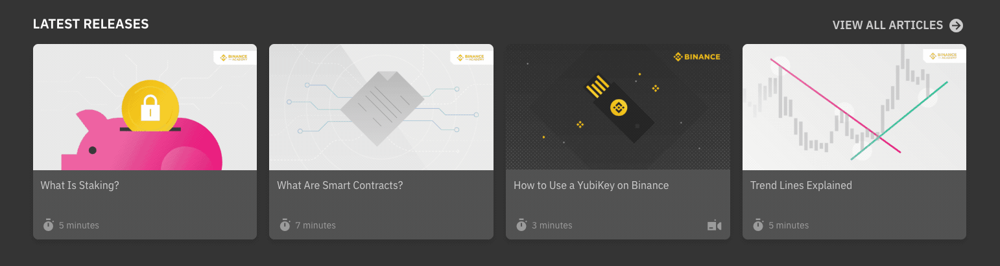

# Image with fallback

Display a fallback while an image is loading, to avoid a jump effect when the image loads.



## Install

```
yarn add @binance-academy/fallback-image
npm install @binance-academy/fallback-image
```

## Usage

### Props

`src`: Url of the image

`alt`: Alternative text to displayed if the image connot be loaded

`invertedRatio`: Inverted ratio as a % (**Default:** 9/16\*100=56.25)

### Example

```javascript
import Image from "fallback-image";

...

<Image alt="Alt text" src="https://via.placeholder.com/800x450" />

<Image
    alt="Alt text"
    src="https://via.placeholder.com/400x300"
    invertedRatio={(3 / 4) * 100}
/>
```
